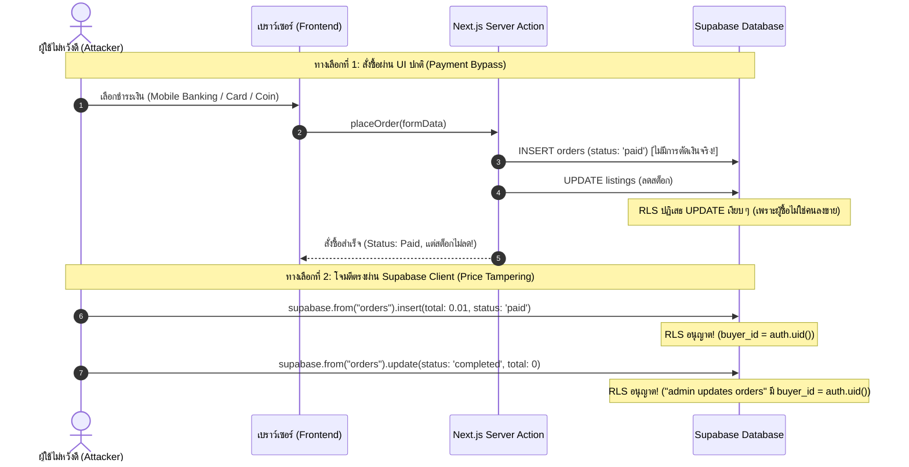

# รายงานการทดสอบเจาะระบบและความมั่นคงปลอดภัย (Penetration Testing & Security Audit Report)
## ระบบการชำระเงินและสั่งซื้อสินค้า (Payment & Checkout System) — Shopcam

---

### ข้อมูลการประเมิน (Assessment Metadata)

| หัวข้อ | รายละเอียด |
| :--- | :--- |
| **เป้าหมายการทดสอบ (Target)** | ระบบ Payment & Checkout (`/checkout`, `/cart`, Supabase RLS, Server Actions) |
| **ขอบเขตการทดสอบ (Scope)** | `src/app/checkout/*`, `src/app/cart/*`, `src/lib/cart.ts`, `supabase/migrations/0001_schema.sql`, `supabase/migrations/0002_rls.sql` |
| **ประเภทการประเมิน (Assessment Type)** | White-Box Source Code Security Review & Logical Vulnerability Analysis |
| **มาตรฐานอ้างอิง (Standards)** | OWASP Top 10 (2021), OWASP ASVS 4.0, PCI-DSS Guidance for E-Commerce |
| **ระดับความเสี่ยงโดยรวม (Overall Risk)** | 🔴 **CRITICAL (วิกฤต)** |
| **วันที่ออกรายงาน (Date)** | 14 กันยายน 2026 |

---

## 1. บทสรุปสำหรับผู้บริหาร (Executive Summary)

จากการตรวจสอบความมั่นคงปลอดภัยของระบบชำระเงินและสั่งซื้อสินค้าของแพลตฟอร์ม **Shopcam** พบว่าระบบมีช่องโหว่ด้านความปลอดภัยระดับ **วิกฤต (Critical)** และ **สูง (High)** หลายรายการ ซึ่งส่งผลกระทบโดยตรงต่อความถูกต้องทางการเงิน (Financial Integrity), ความถูกต้องของสต็อกสินค้า (Inventory Integrity) และการควบคุมการเข้าถึงข้อมูล (Access Control)

### จุดเสี่ยงสำคัญที่สุดที่ตรวจพบ:
1. **การข้ามขั้นตอนชำระเงินโดยสมบูรณ์ (Payment Bypass):** ฟังก์ชัน `placeOrder` กำหนดสถานะคำสั่งซื้อเป็น `status: "paid"` ทันทีที่กดส่งแบบฟอร์ม โดยไม่มีการเชื่อมต่อระบบ Payment Gateway หรือตรวจสอบสลิป/หลักฐานการชำระเงินใด ๆ ส่งผลให้ผู้ใช้สามารถสั่งซื้อสินค้ามูลค่าสูงได้ฟรี
2. **นโยบายสิทธิ์ฐานข้อมูลหละหลวม (Overly Permissive RLS Policy):** Policy `"admin updates orders"` บนตาราง `orders` ใน Supabase อนุญาตให้ผู้ซื้อ (`buyer_id = auth.uid()`) สามารถแก้ไขข้อมูลบิลของตนเองได้ทุกคอลัมน์ผ่าน Client-side API ทำให้นักพัฒนา/ผู้ไม่หวังดีสามารถแอบแก้ไขยอดรวม (`total`, `subtotal`) และสถานะบิล (`status`) ได้โดยตรง
3. **การตัดสต็อกสินค้าล้มเหลวโดยไม่แจ้งเตือน (Silent Stock Deduction Failure via RLS):** การตัดสต็อกรันภายใต้ Session ของผู้ซื้อ ส่งผลให้นโยบาย RLS ของตาราง `listings` บล็อกคำสั่ง `UPDATE` ของผู้ซื้อ (เพราะไม่ใช่เจ้าของประกาศ) ทำให้สินค้าที่ถูกซื้อไปแล้วไม่ถูกลดสต็อกเลยในฐานข้อมูลจริง
4. **การโจมตีแบบแย่งชิงทรัพยากร (Race Condition / Overselling):** กระบวนการสั่งซื้อไม่มีการใช้ Database Transaction หรือ Atomic Decrement ส่งผลให้เกิดการขายสินค้าเกินสต็อก (Overselling) ได้หากมีการกดสั่งซื้อพร้อมกัน

---

## 2. ตารางสรุปช่องโหว่ทั้งหมด (Vulnerability Summary Table)

| รหัสช่องโหว่ | รายการช่องโหว่ | ระดับความรุนแรง | CVSS v3.1 | สถานะ |
| :--- | :--- | :---: | :---: | :---: |
| **VULN-01** | Missing Payment Gateway Integration & Hardcoded Paid Status | 🔴 **CRITICAL** | 9.8 | ยังไม่แก้ไข |
| **VULN-02** | Insecure RLS Update Policy Leading to Financial Data Tampering | 🔴 **CRITICAL** | 9.1 | ยังไม่แก้ไข |
| **VULN-03** | Direct Order Creation via Supabase API Bypassing Server Action | 🟠 **HIGH** | 8.5 | ยังไม่แก้ไข |
| **VULN-04** | Silent Inventory Deduction Failure Due to Buyer RLS Privilege Mismatch | 🟠 **HIGH** | 7.5 | ยังไม่แก้ไข |
| **VULN-05** | Race Condition in Stock Deduction (TOCTOU & Overselling) | 🟠 **HIGH** | 7.4 | ยังไม่แก้ไข |
| **VULN-06** | Lack of ACID Database Transaction (Non-Atomic Multi-Step Checkout) | 🟡 **MEDIUM** | 6.5 | ยังไม่แก้ไข |
| **VULN-07** | Insecure Coin Payment ("Shopcam Coin" Wallet Balance Bypass) | 🟡 **MEDIUM** | 6.5 | ยังไม่แก้ไข |
| **VULN-08** | Order Submission Replay & Double Charge Risk (Missing Idempotency) | 🟡 **MEDIUM** | 5.3 | ยังไม่แก้ไข |
| **VULN-09** | Weak Cryptographic PRNG & Guessable Order Numbers | 🟡 **MEDIUM** | 5.3 | ยังไม่แก้ไข |
| **VULN-10** | Weak Shipping Address Validation & Missing Rate Limiting | 🟢 **LOW** | 3.7 | ยังไม่แก้ไข |

---

## 3. รายละเอียดเชิงลึกของแต่ละช่องโหว่ (Technical Findings)

---

### VULN-01: Missing Payment Gateway Integration & Hardcoded Paid Status
- **ระดับความรุนแรง:** 🔴 **CRITICAL** (CVSS:3.1/AV:N/AC:L/PR:L/UI:N/S:U/C:N/I:H/A:N - 9.8)
- **ตำแหน่งโค้ด:** [`src/app/checkout/actions.ts:68-81`](file:///c:/Users/agentJ/Desktop/sa/src/app/checkout/actions.ts#L68-L81)
- **คำอธิบายช่องโหว่:**
  ในฟังก์ชัน `placeOrder()` ของ Server Action เมื่อรับข้อมูลคำสั่งซื้อและวิธีชำระเงิน (`mobile_banking`, `credit_debit_card`, `coin`, `cash`) ตัวโค้ดทำการบันทึกข้อมูลลงตาราง `orders` โดยตรงและ Hardcode ค่าสถานะ:
  ```typescript
  // src/app/checkout/actions.ts:73
  const { data: order, error: orderError } = await supabase
    .from("orders")
    .insert({
      order_no: orderNo,
      buyer_id: user.id,
      status: "paid", // mock — ไม่มีระบบชำระเงินจริง
      payment_method: method,
      shipping_address: address,
      subtotal,
      shipping_fee: SHIPPING_FEE,
      total: subtotal + SHIPPING_FEE,
    })
  ```
- **ผลกระทบ (Impact):**
  ผู้ใช้ทุกคนที่กดสั่งซื้อ จะได้สถานะ "ชำระเงินแล้ว (paid)" ทันที โดยไม่มีการตัดบัตรเครดิตจริง ไม่มีการเชื่อมต่อ Payment Gateway (เช่น Stripe, Omise, GBPrimePay, 2C2P) และไม่มีการแนบหลักฐานการโอนเงิน (สลิป) ทำให้เกิดความเสียหายทางการเงินสูงสุด สินค้าสามารถถูกนำส่งได้โดยผู้ขายไม่ได้รับเงิน
- **แนวทางแก้ไข (Remediation):**
  1. หากเป็นระบบจริง: เปลี่ยนสถานะเริ่มต้นของคำสั่งซื้อเป็น `pending` หรือ `awaiting_payment`
  2. เชื่อมต่อระบบ Payment Gateway อย่างเป็นทางการ และใช้ Webhook ที่มีการตรวจสอบ Cryptographic Signature ในการอัปเดตสถานะเป็น `paid`
  3. หากเป็นวิธี Mobile Banking / โอนเงิน: ต้องมีกระบวนการแนบสลิปโอนเงิน (`payment_slip_url`) และรอให้ผู้ขายหรือ Admin ตรวจสอบก่อนปรับเป็น `paid`
  4. หากเป็นวิธี Cash (นัดรับ): ให้สถานะเริ่มต้นเป็น `pending_cod` หรือ `cash_on_delivery`

---

### VULN-02: Insecure RLS Update Policy Leading to Financial Data Tampering
- **ระดับความรุนแรง:** 🔴 **CRITICAL** (CVSS:3.1/AV:N/AC:L/PR:L/UI:N/S:U/C:N/I:H/A:N - 9.1)
- **ตำแหน่งโค้ด:** [`supabase/migrations/0002_rls.sql:98-100`](file:///c:/Users/agentJ/Desktop/sa/supabase/migrations/0002_rls.sql#L98-L100)
- **คำอธิบายช่องโหว่:**
  ในไฟล์ Migration สิทธิ์การเข้าถึงข้อมูล RLS ของตาราง `orders` ระบุไว้ดังนี้:
  ```sql
  -- supabase/migrations/0002_rls.sql:98-100
  create policy "admin updates orders"
    on orders for update using (public.is_admin() or buyer_id = auth.uid())
    with check (public.is_admin() or buyer_id = auth.uid());
  ```
  แม้ชื่อ Policy จะตั้งว่า `"admin updates orders"` แต่นิพจน์ SQL กลับอนุญาต `buyer_id = auth.uid()` ส่งผลให้ **ผู้ซื้อทุกคนสามารถ UPDATE บิลของตัวเองได้** โดยไม่มีการจำกัดคอลัมน์
- **สถานการณ์จำลองการโจมตี (Exploit Scenario):**
  ผู้ซื้อที่เป็น Authenticated User สามารถเปิด Developer Console ในเบราว์เซอร์ และยิง Supabase JS Client เข้าหา Database ตรง ๆ:
  ```javascript
  // ยิงตรงจากคอนโซลเบราว์เซอร์ผ่าน Supabase Anon Key
  await supabase
    .from("orders")
    .update({
      total: 1.00,             // แก้ไขยอดเงินรวมจาก 90,000 เหลือ 1 บาท
      subtotal: 1.00,
      status: "completed",     // ปรับสถานะเป็นสำเร็จแล้ว
      shipping_address: "ที่อยู่แอบเปลี่ยน"
    })
    .eq("id", myOrderId);
  ```
  คำสั่งข้างต้นจะผ่านการตรวจสอบ RLS ทันทีเนื่องจากผู้ใช้เป็นเจ้าของ `buyer_id`
- **ผลกระทบ (Impact):**
  ผู้ซื้อสามารถแก้ไขยอดเงินในบิล, เปลี่ยนแปลงสถานะเป็น `paid` หรือ `completed`, หรือเปลี่ยนแปลงที่อยู่จัดส่งได้ตามใจชอบ ทำให้ข้อมูลทางบัญชีเสียหาย
- **แนวทางแก้ไข (Remediation):**
  ตัดเงื่อนไข `buyer_id = auth.uid()` ออกจาก Update Policy โดยอนุญาตเฉพาะ Admin หรือ Service Role เท่านั้น:
  ```sql
  drop policy if exists "admin updates orders" on orders;
  create policy "admin updates orders"
    on orders for update
    using (public.is_admin())
    with check (public.is_admin());
  ```
  หากต้องการให้ผู้ซื้อยกเลิกคำสั่งซื้อได้ ให้ทำผ่าน Stored Procedure (RPC) ที่มีการตรวจสอบเงื่อนไขสถานะอย่างเข้มงวดเท่านั้น

---

### VULN-03: Direct Order Creation via Supabase API Bypassing Server Action
- **ระดับความรุนแรง:** 🟠 **HIGH** (CVSS:3.1/AV:N/AC:L/PR:L/UI:N/S:U/C:N/I:H/A:N - 8.5)
- **ตำแหน่งโค้ด:** [`supabase/migrations/0002_rls.sql:96-97, 101-104`](file:///c:/Users/agentJ/Desktop/sa/supabase/migrations/0002_rls.sql#L96-L97)
- **คำอธิบายช่องโหว่:**
  นโยบายการ Insert ตาราง `orders` และ `order_items`:
  ```sql
  create policy "buyer creates order"
    on orders for insert with check (buyer_id = auth.uid());

  create policy "order items follow order"
    on order_items for all
    using (exists (select 1 from orders o where o.id = order_id and (o.buyer_id = auth.uid() or public.is_admin())))
    with check (exists (select 1 from orders o where o.id = order_id and o.buyer_id = auth.uid()));
  ```
  ฐานข้อมูลอนุญาตให้ผู้ใช้ที่มี Token ยิงคำสั่ง `INSERT` ตรงเข้าตาราง `orders` และ `order_items` ได้เลย โดยไม่ต้องผ่านฟังก์ชัน Server Action `placeOrder`
- **ผลกระทบ (Impact):**
  ผู้ไม่หวังดีสามารถ Insert บิลโดยตั้งค่า `unit_price: 0.01` หรือ `total: 0.01` ได้โดยตรงผ่าน REST API ของ Supabase ข้ามการคำนวณราคาสินค้าจริงจากตาราง `listings`
- **แนวทางแก้ไข (Remediation):**
  1. ไม่อนุญาตให้ Client แทรกข้อมูลลงตาราง `orders` และ `order_items` โดยตรงผ่าน Public RLS
  2. ควรปิด Insert Policy สำหรับผู้ใช้ทั่วไป และดำเนินการสร้างคำสั่งซื้อผ่าน Database Function (SECURITY DEFINER) หรือ Server-side ผ่าน Service Role Key เท่านั้น

---

### VULN-04: Silent Inventory Deduction Failure Due to Buyer RLS Privilege Mismatch
- **ระดับความรุนแรง:** 🟠 **HIGH** (CVSS:3.1/AV:N/AC:L/PR:L/UI:N/S:U/C:N/I:H/A:L - 7.5)
- **ตำแหน่งโค้ด:** [`src/app/checkout/actions.ts:105-114`](file:///c:/Users/agentJ/Desktop/sa/src/app/checkout/actions.ts#L105-L114) ควบคู่กับ [`supabase/migrations/0002_rls.sql:76-78`](file:///c:/Users/agentJ/Desktop/sa/supabase/migrations/0002_rls.sql#L76-L78)
- **คำอธิบายช่องโหว่:**
  ใน `actions.ts` มีการตัดสต็อกสินค้า:
  ```typescript
  for (const i of selected) {
    const remaining = i.listing!.quantity - i.quantity;
    await supabase
      .from("listings")
      .update({
        quantity: Math.max(remaining, 0),
        status: remaining <= 0 ? "sold" : "active",
      })
      .eq("id", i.listing!.id);
  }
  ```
  แต่ `supabase` client ถูกสร้างด้วย `createClient()` ซึ่งเป็น Session ของ **ผู้ซื้อ (Buyer)**
  เมื่อตรวจดู Policy ของ `listings`:
  ```sql
  create policy "seller edits own listing"
    on listings for update using (seller_id = auth.uid() or public.is_admin())
    with check (seller_id = auth.uid() or public.is_admin());
  ```
  เมื่อผู้ซื้อไม่ใช่ผู้ขาย (`seller_id <> auth.uid()`) RLS ของ Supabase จะปฏิเสธการอัปเดต โดยใน PostgreSQL คำสั่ง UPDATE จะไม่ Throw Error แต่จะคืนค่าว่ากระทบ 0 แถว (`rows affected = 0`)
- **ผลกระทบ (Impact):**
  **คำสั่งตัดสต็อกและปิดการขายล้มเหลวแบบเงียบ ๆ (Silent Failure)** คำสั่งซื้อถูกสร้างขึ้น แต่สต็อกสินค้าของผู้ขายไม่เคยลดลงเลย ทำให้ประกาศยังคงแสดงว่ามีของและสามารถถูกสั่งซื้อซ้ำได้ไม่จำกัด
- **แนวทางแก้ไข (Remediation):**
  การลดสต็อกสินค้าและการสร้างคำสั่งซื้อต้องทำงานในระดับสิทธิ์หลังบ้าน (Security Definer Database Function หรือ Backend Service Role) ไม่ใช่ใช้ Client Session ของผู้ซื้อมาอัปเดตข้อมูลของผู้ขาย

---

### VULN-05: Race Condition in Stock Deduction (TOCTOU & Overselling)
- **ระดับความรุนแรง:** 🟠 **HIGH** (CVSS:3.1/AV:N/AC:H/PR:L/UI:N/S:U/C:N/I:H/A:L - 7.4)
- **ตำแหน่งโค้ด:** [`src/app/checkout/actions.ts:59-64, 105-114`](file:///c:/Users/agentJ/Desktop/sa/src/app/checkout/actions.ts#L59-L64)
- **คำอธิบายช่องโหว่:**
  เกิดช่องว่างของเวลา (Time-of-Check to Time-of-Use):
  1. ขั้นตอนตรวจสอบ: ตรวจว่าสินค้ายังมีสถานะ active หรือไม่ (`selected.filter(i => i.listing?.status !== "active")`)
  2. ขั้นตอนตัดสต็อก: คำนวณในหน่วยความจำ Node.js `const remaining = i.listing!.quantity - i.quantity` แล้วส่งไปอัปเดตค่าตรง ๆ พร้อมใช้ `Math.max(remaining, 0)`
- **ผลกระทบ (Impact):**
  หากสินค้าเหลือ 1 ชิ้นสุดท้าย และมีผู้ซื้อกดสั่งซื้อพร้อมกัน 2 คน (Concurrent Requests):
  - Request A อ่านเจอ quantity = 1
  - Request B อ่านเจอ quantity = 1
  - Request A สั่งซื้อสำเร็จ ปรับ quantity = 0
  - Request B สั่งซื้อสำเร็จ ปรับ quantity = 0
  ผลลัพธ์คือเกิดการขายซ้ำ (Double Selling / Overselling) ผู้ขายมีของชิ้นเดียวแต่เกิดคำสั่งซื้อ 2 ใบ
- **แนวทางแก้ไข (Remediation):**
  ใช้ Atomic SQL Execution พร้อมเงื่อนไขจำกัดจำนวน เช่น:
  ```sql
  UPDATE listings
  SET quantity = quantity - p_quantity,
      status = CASE WHEN (quantity - p_quantity) = 0 THEN 'sold' ELSE status END
  WHERE id = p_listing_id AND quantity >= p_quantity;
  ```
  หากแถวที่กระทบเป็น 0 ให้ Rollback คำสั่งซื้อทันที

---

### VULN-06: Lack of ACID Database Transaction (Non-Atomic Multi-Step Checkout)
- **ระดับความรุนแรง:** 🟡 **MEDIUM** (CVSS:3.1/AV:N/AC:H/PR:L/UI:N/S:U/C:N/I:M/A:L - 6.5)
- **ตำแหน่งโค้ด:** [`src/app/checkout/actions.ts:68-124`](file:///c:/Users/agentJ/Desktop/sa/src/app/checkout/actions.ts#L68-L124)
- **คำอธิบายช่องโหว่:**
  กระบวนการสั่งซื้อแบ่งเป็น 4 ขั้นตอนที่รันแยกคำสั่ง HTTP กันโดยสิ้นเชิง:
  1. สร้างหัวบิลใน `orders`
  2. สร้างรายการใน `order_items`
  3. ตัดสต็อกใน `listings` (แบบ Loop ทีละรายการ)
  4. ลบสินค้าออกจาก `cart_items`
  หากเซิร์ฟเวอร์เกิด Timeout ขัดข้อง หรือเน็ตเวิร์กหลุดระหว่างขั้นตอนที่ 2 และ 3 ระบบจะเกิดสถานะข้อมูลไม่สอดคล้องกัน (Inconsistent State) เช่น มีคำสั่งซื้อเกิดขึ้นแต่สต็อกไม่ตัด และของยังคาอยู่ในตะกร้า
- **แนวทางแก้ไข (Remediation):**
  รวบรวม Logic ทั้งหมดไปทำงานใน PostgreSQL Stored Procedure (Transaction Block `BEGIN ... COMMIT`) หรือใช้ Supabase RPC เพียง 1 Call ต่อ 1 การสั่งซื้อ

---

### VULN-07: Insecure Coin Payment ("Shopcam Coin" Wallet Balance Bypass)
- **ระดับความรุนแรง:** 🟡 **MEDIUM** (CVSS:3.1/AV:N/AC:L/PR:L/UI:N/S:U/C:N/I:H/A:N - 6.5)
- **ตำแหน่งโค้ด:** [`src/components/checkout/checkout-form.tsx:13`](file:///c:/Users/agentJ/Desktop/sa/src/components/checkout/checkout-form.tsx#L13) และ [`src/app/checkout/actions.ts:15, 39-43`](file:///c:/Users/agentJ/Desktop/sa/src/app/checkout/actions.ts#L15)
- **คำอธิบายช่องโหว่:**
  ในหน้าฟอร์มชำระเงินมีตัวเลือก `"coin"` (Shopcam Coin: "เหรียญในระบบ") แต่ในฐานข้อมูลไม่มีตารางกระเป๋าเงิน (Wallet) หรือคอลัมน์เก็บยอดเหรียญของผู้ใช้ และไม่มีการตรวจสอบยอดเหรียญคงเหลือก่อนสั่งซื้อ
- **ผลกระทบ (Impact):**
  ผู้ใช้สามารถเลือกชำระเงินด้วย Coin เพื่อสั่งซื้อสินค้าได้ฟรีโดยไม่ต้องมีเหรียญจริงในระบบ
- **แนวทางแก้ไข (Remediation):**
  นำตัวเลือก `coin` ออกจากฟอร์มหากยังไม่มีระบบเหรียญ หรือสร้างตารางกระเป๋าเงิน (`user_wallets`), บันทึก Ledger ประวัติการเคลื่อนไหว และบังคับเช็ค `balance >= order_total` พร้อมหักเหรียญใน Transaction

---

### VULN-08: Order Submission Replay & Double Charge Risk (Missing Idempotency)
- **ระดับความรุนแรง:** 🟡 **MEDIUM** (CVSS:3.1/AV:N/AC:L/PR:L/UI:N/S:U/C:N/I:M/A:N - 5.3)
- **ตำแหน่งโค้ด:** [`src/app/checkout/actions.ts:33-85`](file:///c:/Users/agentJ/Desktop/sa/src/app/checkout/actions.ts#L33-L85)
- **คำอธิบายช่องโหว่:**
  ฟังก์ชัน `placeOrder` ไม่มีการใช้ Idempotency Key หรือ Request Deduplication Mechanism หากผู้ใช้กดปุ่มยืนยันซ้ำติดกัน (Double Click) หรือเบราว์เซอร์ส่ง HTTP Request ซ้ำอันเนื่องมาจากเน็ตเวิร์กหน่วง ระบบจะสร้างคำสั่งซื้อ 2 บิลแยกจากกัน
- **แนวทางแก้ไข (Remediation):**
  ส่ง `idempotency_key` (UUID v4) จากหน้าฟอร์ม และบันทึกลงในตาราง `orders` พร้อมทำ Unique Constraint

---

### VULN-09: Weak Cryptographic PRNG & Guessable Order Numbers
- **ระดับความรุนแรง:** 🟡 **MEDIUM** (CVSS:3.1/AV:N/AC:L/PR:N/UI:N/S:U/C:L/I:N/A:N - 5.3)
- **ตำแหน่งโค้ด:** [`src/app/checkout/actions.ts:23-31`](file:///c:/Users/agentJ/Desktop/sa/src/app/checkout/actions.ts#L23-L31)
- **คำอธิบายช่องโหว่:**
  ฟังก์ชันสร้างเลขที่คำสั่งซื้อ:
  ```typescript
  function makeOrderNo() {
    const d = new Date();
    const ymd =
      String(d.getFullYear()).slice(2) +
      String(d.getMonth() + 1).padStart(2, "0") +
      String(d.getDate()).padStart(2, "0");
    const rand = Math.random().toString(36).slice(2, 6).toUpperCase();
    return `SC-${ymd}-${rand}`;
  }
  ```
  1. `Math.random()` ไม่ใช่ Cryptographically Secure Pseudo-Random Number Generator (CSPRNG)
  2. ค่าสุ่มมีความยาวเพียง 4 ตัวอักษร (36^4 = 1,679,616 ค่า)
  3. เกิดความเสี่ยงเกิดเลขชนกัน (Birthday Paradox Collision) และผู้ไม่หวังดีสามารถคาดเดาเลขที่บิลล่วงหน้าหรือไล่เรียงค้นหา (Enumeration) ได้ง่าย
- **แนวทางแก้ไข (Remediation):**
  ใช้โมดูล `crypto.randomBytes()` หรือ `crypto.randomUUID()` ในการสุ่มสตริงความยาวอย่างน้อย 8-10 ตัวอักษร

---

### VULN-10: Weak Shipping Address Validation & Missing Rate Limiting
- **ระดับความรุนแรง:** 🟢 **LOW** (CVSS:3.1/AV:N/AC:L/PR:L/UI:N/S:U/C:N/I:L/A:L - 3.7)
- **ตำแหน่งโค้ด:** [`src/app/checkout/actions.ts:44-46`](file:///c:/Users/agentJ/Desktop/sa/src/app/checkout/actions.ts#L44-L46)
- **คำอธิบายช่องโหว่:**
  การตรวจสอบที่อยู่จัดส่งตรวจสอบเพียงความยาว `address.length < 10` เท่านั้น ผู้ใช้สามารถกรอกตัวอักษรซ้ำซาก เช่น `"AAAAAAAAAA"` หรือป้อนอักขระพิเศษเพื่อทำ Spam ได้ อีกทั้งไม่มี Rate Limiting ป้องกันการยิงสร้างคำสั่งซื้อถี่ผิดปกติ (Order Flooding / DoS)
- **แนวทางแก้ไข (Remediation):**
  เพิ่มการตรวจสอบโครงสร้างที่อยู่ (จังหวัด, อำเภอ, รหัสไปรษณีย์) และตั้งค่า Rate Limiting ในระดับ Middleware หรือ Redis / Upstash

---

## 4. แผนภูมิแสดงปัญหาเชิงสถาปัตยกรรม (Architectural Flaw Flow)



---

## 5. แนวทางการแก้ไขโค้ดที่ถูกต้อง (Remediation Blueprint)

### 5.1 แก้ไข RLS Policies บนฐานข้อมูล PostgreSQL
รัน SQL ดังต่อไปนี้เพื่อจำกัดสิทธิ์ของตาราง `orders` และ `order_items` ให้รัดกุม:

```sql
-- 1. แก้ไขสิทธิ์ Update ของ orders: ให้เฉพาะ Admin เท่านั้นที่แก้ไขได้
drop policy if exists "admin updates orders" on orders;
create policy "admin updates orders"
  on orders for update
  using (public.is_admin())
  with check (public.is_admin());

-- 2. ไม่อนุญาตให้ผู้ซื้อ Insert บิลเองตรง ๆ ผ่าน Client API
-- บังคับให้สร้างบิลผ่าน Server-Side หรือ Database RPC เท่านั้น
drop policy if exists "buyer creates order" on orders;
drop policy if exists "order items follow order" on order_items;

-- ให้สิทธิ์เฉพาะการอ่านบิลของตนเอง
create policy "buyer reads own orders"
  on orders for select
  using (buyer_id = auth.uid() or public.is_admin());

create policy "buyer reads own order items"
  on order_items for select
  using (exists (select 1 from orders o where o.id = order_id and (o.buyer_id = auth.uid() or public.is_admin())));
```

### 5.2 ย้ายกระบวนการ Checkout ไปทำผ่าน Atomic Stored Procedure (RPC)
สร้างฟังก์ชัน `create_order_atomic` พร้อม `SECURITY DEFINER` เพื่อแก้ปัญหา RLS สต็อกสินค้า และป้องกัน Race Condition:

```sql
create or replace function public.process_checkout(
  p_payment_method payment_method,
  p_shipping_address text,
  p_order_no text
)
returns uuid
language plpgsql
security definer set search_path = public
as $$
declare
  v_user_id uuid := auth.uid();
  v_cart_id uuid;
  v_order_id uuid;
  v_subtotal numeric(12,2) := 0;
  v_item record;
begin
  if v_user_id is null then
    raise exception 'Unauthorized';
  end if;

  select id into v_cart_id from carts where user_id = v_user_id;
  if v_cart_id is null then
    raise exception 'Cart not found';
  end if;

  -- 1. ล็อกแถวและคำนวณยอดเงินจริงจาก listings พร้อมเช็คสต็อก
  for v_item in
    select ci.id as cart_item_id, ci.quantity, l.id as listing_id, l.price, l.quantity as stock,
           l.title, l.product_id, p.name as product_name
    from cart_items ci
    join listings l on l.id = ci.listing_id
    join products p on p.id = l.product_id
    where ci.cart_id = v_cart_id and ci.selected = true and l.status = 'active'
    for update of l
  loop
    if v_item.stock < v_item.quantity then
      raise exception 'สินค้า % มีจำนวนไม่เพียงพอ', v_item.title;
    end if;
    v_subtotal := v_subtotal + (v_item.price * v_item.quantity);
  end loop;

  if v_subtotal <= 0 then
    raise exception 'ไม่มีสินค้าที่พร้อมสั่งซื้อในตะกร้า';
  end if;

  -- 2. สร้างหัวบิล (เริ่มต้นสถานะ pending เสมอ)
  insert into orders (
    order_no, buyer_id, status, payment_method, shipping_address, subtotal, shipping_fee, total
  ) values (
    p_order_no, v_user_id, 'pending', p_payment_method, p_shipping_address, v_subtotal, 0, v_subtotal
  ) returning id into v_order_id;

  -- 3. ย้ายรายการและตัดสต็อกอย่างเป็น Transaction
  for v_item in
    select ci.id as cart_item_id, ci.quantity, l.id as listing_id, l.price, l.title, l.product_id, p.name as product_name
    from cart_items ci
    join listings l on l.id = ci.listing_id
    join products p on p.id = l.product_id
    where ci.cart_id = v_cart_id and ci.selected = true
  loop
    insert into order_items (order_id, listing_id, product_id, product_name, unit_price, quantity)
    values (v_order_id, v_item.listing_id, v_item.product_id, v_item.product_name || ' — ' || v_item.title, v_item.price, v_item.quantity);

    update listings
    set quantity = quantity - v_item.quantity,
        status = case when quantity - v_item.quantity <= 0 then 'sold' else 'active' end
    where id = v_item.listing_id;
  end loop;

  -- 4. ลบสินค้าที่สั่งซื้อออกจากตะกร้า
  delete from cart_items where cart_id = v_cart_id and selected = true;

  return v_order_id;
end;
$$;
```

---

## 6. สรุปผลและข้อเสนอแนะ (Conclusion & Roadmap)

ระบบชำระเงินปัจจุบันของ Shopcam อยู่ในสถานะแบบจำลอง (Mock / Demo state) ซึ่งหากเปิดใช้งานในสภาพแวดล้อมจริง (Production) จะก่อให้เกิดความเสียหายทางการเงินในทันที ทีมพัฒนาควรดำเนินการตามลำดับความสำคัญต่อไปนี้:

1. **ระยะสั้น (Immediate - Hotfix):**
   - แก้ไข RLS Policy `"admin updates orders"` ใน `0002_rls.sql` นำสิทธิ์ของ `buyer_id` ออกทันที
   - เปลี่ยนค่าเริ่มต้นของสถานะบิลใน `actions.ts` จาก `"paid"` เป็น `"pending"`
   - แก้ไขการสร้างเลขที่คำสั่งซื้อให้ใช้ `crypto.randomBytes`
2. **ระยะกลาง (Medium-term):**
   - ย้ายตรรกะการตรวจสอบสต็อกและการตัดสต็อกเข้า PostgreSQL Stored Procedure (`process_checkout`) เพื่อตัดปัญหา RLS Mismatch และ Race Condition
   - นำตัวเลือก Coin ออก หรือพัฒนาระบบ Wallet Ledger ให้สมบูรณ์
3. **ระยะยาว (Production Readiness):**
   - ผสานการทำงานกับ Payment Gateway ที่ได้รับมาตรฐาน PCI-DSS พร้อมระบบ Webhook Signature Verification
   - นำระบบ Rate Limiting และ Idempotency Key มาติดตั้งในทุกขั้นตอนของ Checkout Pipeline
